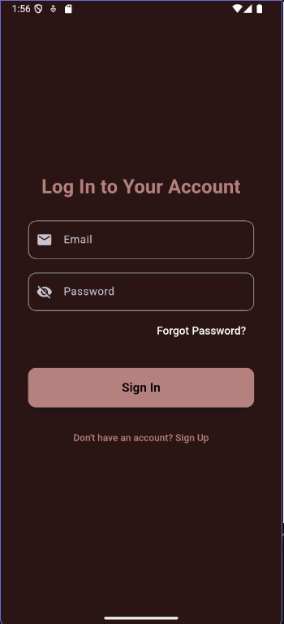
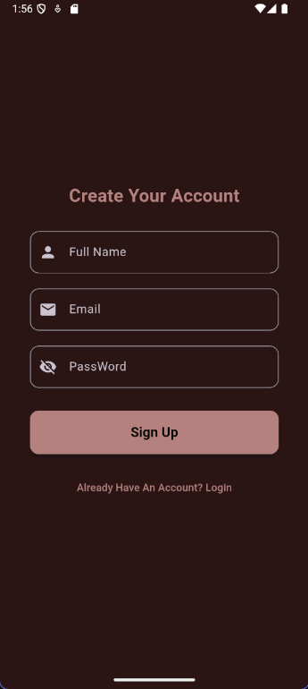
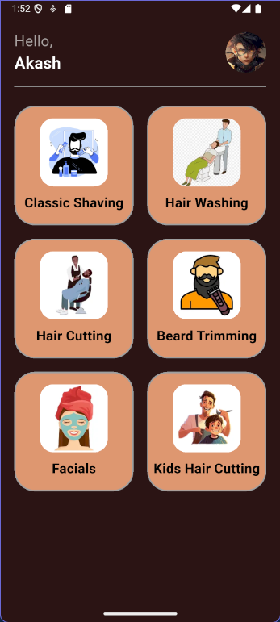
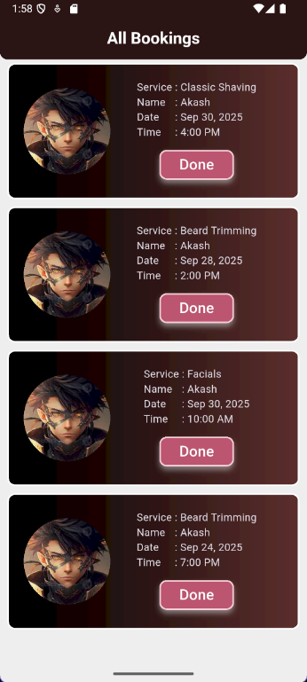
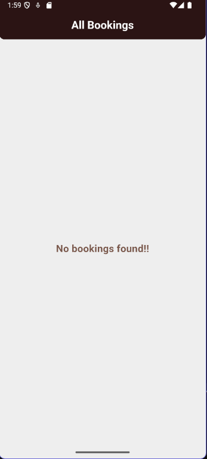

# Firebase App — Barber/Salon Booking

A Flutter application integrated with Firebase that lets users sign up, sign in, and book services (date/time). An admin panel lists all bookings and allows marking them as done.

## Features

- **Firebase Auth**: Email/password signup and login
- **Cloud Firestore**: Store user profiles and bookings
- **Local Storage**: `shared_preferences` for storing user info locally
- **Booking Flow**: Select service, date, and time; confirm booking
- **Admin Panel**: View all bookings in real time; mark as done (deletes the booking document)
- **Modern UI**: Dark theme with responsive layouts

## Tech Stack

- **Flutter** (Dart 3)
- **Firebase Core, Auth, Firestore**
- **intl**, **random_string**, **shared_preferences**

## Project Structure (key parts)

```
lib/
├─ main.dart                       # App entry; initializes Firebase
├─ utils/firebase_options.dart     # FlutterFire-generated config
├─ Screen/
│  ├─ home.dart                    # Services grid and navigation to booking
│  ├─ signin.dart                  # User sign in
│  └─ signup.dart                  # User registration
├─ Admin/
│  ├─ AdminLogin.dart              # Admin login (Firestore-based)
│  └─ AdminHome.dart               # Admin bookings list
└─ Data/
   ├─ data.dart                    # Static services list
   ├─ database.dart                # Firestore CRUD helpers
   └─ shared.dart                  # SharedPreferences wrapper
```

## Prerequisites

- Flutter SDK installed and on PATH
- Firebase project created
- FlutterFire CLI installed (`dart pub global activate flutterfire_cli`)

## Setup

1. Install dependencies
   ```bash
   flutter pub get
   ```
2. Configure Firebase (if not already)
   - Run:
     ```bash
     flutterfire configure
     ```
     This generates `lib/firebase_options.dart` (you already have `lib/utils/firebase_options.dart`; keep the one used in `main.dart`).
   - Android: ensure `android/app/google-services.json` exists (present in this repo).
   - iOS/macOS: add `GoogleService-Info.plist` via Xcode or FlutterFire CLI output.
   - Web: FlutterFire will inject config; ensure `firebase_core` is initialized before run.
3. Run the app
   ```bash
   flutter run
   ```

## Admin Login (seeding data)

Create a Firestore collection `Admin` with a document containing:
- **Username**: string
- **Password**: string

The admin screen (`AdminLogin`) queries `Admin` by `Username` and validates the plain-text `Password`, then opens `AdminHomepage` to see bookings.

## Booking Data Model

Bookings are stored in `booking` collection with fields:
- **Service**, **Date**, **Time**, **Name**, **Image**, **Email**

Admin “Done” deletes the corresponding document by ID.

## Screenshots

<table style="border: none;">
  <tr>
    <td align="center" style="border: none; padding: 10px;">
      
      <br />
      Admin Home
    </td>
    <td align="center" style="border: none; padding: 10px;">
      
      <br />
      Admin Login
    </td>
    <td align="center" style="border: none; padding: 10px;">
      
      <br />
      Admin No Booking
    </td>
    <td align="center" style="border: none; padding: 10px;">
      
      <br />
      User Home
    </td>
  </tr>
  <tr>
    <td align="center" style="border: none; padding: 10px;">
      
      <br />
      User Sign In
    </td>
    <td align="center" style="border: none; padding: 10px;">
      
      <br />
      User Sign Up
    </td>
    <td align="center" style="border: none; padding: 10px;">
      
      <br />
      User Booking
    </td>
    <td align="center" style="border: none; padding: 10px;">
      </td>
  </tr>
  <tr>
    <td align="center" style="border: none; padding: 10px;">
      </td>
    <td align="center" style="border: none; padding: 10px;">
      </td>
    <td align="center" style="border: none; padding: 10px;">
      </td>
    <td align="center" style="border: none; padding: 10px;">
      </td>
  </tr>
  <tr>
    <td align="center" style="border: none; padding: 10px;">
      </td>
    <td align="center" style="border: none; padding: 10px;">
      </td>
    <td align="center" style="border: none; padding: 10px;">
      </td>
    <td align="center" style="border: none; padding: 10px;">
      </td>
  </tr>
</table>

## Notes

- `main.dart` currently sets `home: Adminlogin()`. Uncomment the `StreamBuilder` in `main.dart` if you want auth-aware routing to `Home`/`SignInPage`.
- Minimum Android SDK is 23; Gradle config applies Google services.
- If you rename or regenerate Firebase options, ensure imports in `main.dart` match the file path (`lib/utils/firebase_options.dart` in this project).

## Troubleshooting

- **Firebase initialization errors**: Verify `flutterfire configure` completed and options file import path matches `main.dart`.
- **Auth errors**: Check Firebase Authentication is enabled for Email/Password.
- **Firestore permissions**: Update Firestore rules for development if needed.
- **Web build**: Clear cache or run `flutter clean` if config changes.

## License

This project includes a `LICENSE` file at the repo root.